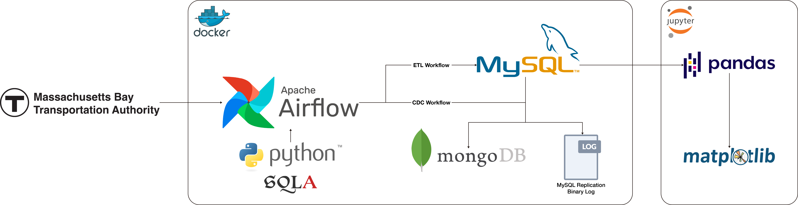

# Real-time Transit Data Pipeline: ETL and CDC from MBTA to MySQL and MongoDB

## Description
This project presents a comprehensive and integrated real-world data engineering pipeline that leverages real-time transit data from the Massachusetts Bay Transportation Authority (MBTA).

The pipeline demonstrates the use of Extract, Transform, Load (ETL) and Change Data Capture (CDC) processes to ensure real-time data ingestion and storage, as well as data synchronization across storage systems for efficient data replication and consistency. Utilizing a variety of data engineering tools and technologies, including Docker, Apache Airflow, MySQL, MongoDB, and Python MySQL Replication, the pipeline supports real-time data availability, event-driven architectures, and disaster recovery. This makes it an exemplary model for handling dynamic data in a production-like environment.

In addition to real-time data handling, the pipeline also facilitates historical data analysis and visualization. This enables time-series analysis and trend detection to provide insights into transit patterns, informing decision-making and optimizing transit operations.

<h2>Table of Contents</h2>

- [Overview](#overview)
- [Benefits](#benefits)
- [Architecture](#architecture)
- [Prerequisites](#prerequisites)
- [System Setup](#system-setup)

## Overview
The pipeline is designed to:
1. **Real-time Data Ingestion**:
    - Create a MySQL database within a Docker container to store real-time data fetched from the MBTA API.
    - Periodically call the MBTA API every 10 seconds, parse the JSON response, and store the data in the MySQL database for further analysis.
    - Run the server for 24 hours to continuously collect and store data.
2. **Change Data Capture (CDC)**:
    - Monitor and propagate changes from the MySQL database to a MongoDB database.
    - Capture MySQL binary logs to track and replicate data changes efficiently.
3. **Data analysis and visualization**:
    - Perform in-depth data analysis and visualization on data stored in the MySQL database using Jupyter Notebook.
    - Calculate the average time for a bus to complete Route 1 and estimate bus speed using the Haversine formula.
    - Visualize the analysis results to understand traffic patterns and peak times in Boston.

## Benefits
- **Real-Time Data Synchronization**: Ensuring MongoDB is always in sync with MySQL by capturing and storing data changes in near real-time.
- **Data Consistency and Integrity Monitoring**: Monitoring data consistency and integrity between MySQL and MongoDB using CDC logs.
- **Event-Driven Architectures**: Triggering actions based on changes captured by CDC, enhancing system responsiveness and automation.
- **Disaster Recovery and Backup**: Utilizing MySQL binary logs captured by CDC for robust disaster recovery.
- **Historical Analysis and Visualization**: Deriving insights and visualizations from the MBTA data stored in MySQL.

## Architecture


1. **MBTA API**: Source of real-time transit data.
2. **Docker**: Containerization of services.
3. **Apache Airflow**: ETL and CDC workflows orchestration.
4. **MySQL**: Stores real-time data fetched from MBTA API.
5. **MongoDB**: Receives data changes from MySQL via CDC.
6. **Python MySQL Replication**: Supports the MySQL binary log CDC process.
7. **SQLAlchemy**: Facilitates database connections and interactions.
8. **Pandas and Matplotlib**: Data analysis and visualization performed in Jupyter Notebook.

## Prerequisites
- Docker installation.
- Python 3.9 or higher.

## System Setup
1. Clone the repository.
2. Navigate to the root directory where the Dockerfile is located.
3. Start Docker container for Apache Airflow.
    ```bash
    docker-compose up
    ```
4. Launch the Airflow web UI.
    ```bash
    open http://localhost:8080
    ```
5. Set up Docker network, build customized container image for MySQL, and start Docker containers for both MySQL and MongoDB.
    ```bash
    python3 containers.py -network
    python3 containers.py -image
    python3 containers.py -create
    ```
6. Deploy the Airflow DAG and start the pipeline.
    ```bash
    airflow dags trigger mbta_etl_cdc_pipeline
    ```
    or manually trigger the DAG from the Airflow web UI.
